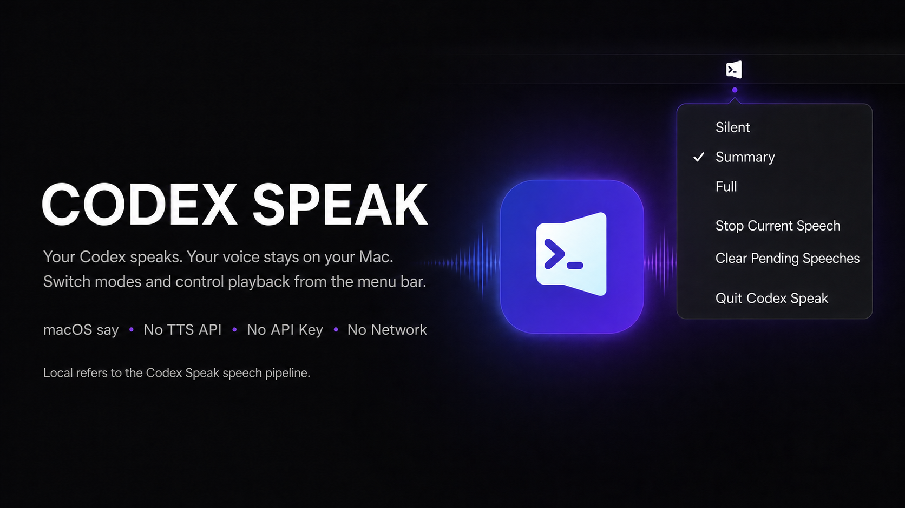

# Codex Speak



Codex Speak is a local macOS Codex Plugin that speaks turn outcomes with the
system `say` command. It can announce concise outcome summaries or read the
complete visible response, while a private menu bar helper provides playback
controls without adding commands to the conversation.

## Requirements

- macOS 13.0 or newer
- Python 3.10 or newer available as `python3`
- Codex with Plugin lifecycle-hook support
- Xcode command-line tools with Swift 6 only when rebuilding the menu helper

Runtime operation uses the Python standard library and macOS frameworks. It
needs no network service, API key, third-party Python package, custom voice,
or global Codex `notify` setting.

## Install and trust

Register the public GitHub repository as a Codex marketplace:

```bash
codex plugin marketplace add Howe829/codex-speak --ref main
```

Open Codex, enter `/plugins`, select **Howe829 Plugins**, open **Codex Speak**,
and install it. The equivalent CLI command is:

```bash
codex plugin add codex-speak@howe829
```

Open `/hooks` after installation, review the bundled `SessionStart` and `Stop`
commands, and trust the current definitions. Codex asks again when a hook
definition changes. Start a new task after installation or reinstall so the
SessionStart protocol and hook paths bind to the installed version.

## Release status and Stop-hook upgrades

The current public Marketplace release is version 0.2.10.
The source ref is `v0.2.10`.

On SessionStart, the plugin installs a private fixed launcher at
`runtime-hooks/stop_launcher.py` under plugin data, and Stop prefers that
launcher. The launcher considers only real, valid direct version siblings from
the same Marketplace and plugin cache family before it selects the current
runtime. Hook stdin and speech text are piped directly to the selected Stop
process: no speech content is stored in the launcher, command arguments, or
diagnostics.

This creates a one-time boundary at the first fixed release. As a result,
pre-fix open tasks cannot be retroactively repaired by the new hook definition
because they already captured their old command; replace each with a new task.
In contrast, tasks started on the fixed release survive later upgrades, even when a
Marketplace cache replacement removes the original version directory.

If a valid runtime is missing, the launcher fails with an empty hook result
instead of exposing a Python path error. Reinstall the plugin and start a new
task to establish a valid fixed launcher and current runtime.

The embedded app is built and ad hoc signed locally. macOS may ask for local
execution approval if the checkout or app was downloaded or quarantined;
review its origin before approving it. Do not bypass Gatekeeper for an app you
do not trust.

## Speech modes and outcomes

The menu bar checkmark selects one speech mode:

- `Silent` immediately stops current speech, clears pending speech, and
  suppresses future events. The selection persists across restarts. Returning
  to `Summary` or `Full` does not replay events discarded while Silent was
  active; only new eligible events play.
- `Summary` speaks only important `completed`, `blocked`, or
  `action_required` outcome text. Ordinary `silent` answers remain quiet.
- `Full` reads the normalized visible response. Markdown formatting, code
  blocks, URLs, and local paths are replaced with speech-safe descriptions.
  Double-quote delimiters are removed so macOS speaks their enclosed text.
  Any non-empty single-backtick span up to 32 characters is spoken as text,
  including punctuation and code-shaped content, after URL, path, and control-
  character privacy cleaning. Longer spans and multi-backtick spans retain the
  `代码` placeholder. The public `/hooks` command label stays visible without
  relaxing the fail-closed handling of arbitrary local paths.
  Full speech runs one sentence per local `say` process, with oversized
  sentences split again at 180 characters, so a voice-engine early completion
  cannot discard every later sentence in the response.

Important completed, blocked, and action-required announcements begin with the
real Codex task title. The lead follows the conversation language and known
form of address; unknown users get a neutral lead. Codex Speak reads the title
locally through Codex `thread/read` and falls back to `current task` (or the
Chinese equivalent) when lookup does not finish within 1.5 seconds.

Important announcements follow the active primary instruction. Internal
commands, temporary files, tests, test fixtures, validation artifacts, and
tool mechanics remain unspoken unless explicitly requested. Language,
salutation, and tone come from active context such as `AGENTS.md`, memory, and
conversation preferences; the plugin does not hard-code a user's name.

The default macOS voice and rate are used. `Plugin Toggle` in Codex controls the whole plugin,
including both hooks and speech; it is not a mode selector.
Use `Silent`, `Summary`, or `Full` in the menu to change only the speech mode.
The checkmark is refreshed from persisted settings whenever the menu opens, so
changes made by another trusted local control are reflected before selection.

## Menu controls

The menu bar follows your macOS preferred language and supports English and Simplified Chinese.

The helper has exactly six menu actions:

1. `Silent`
2. `Summary`
3. `Full`
4. `Stop Current Speech`
5. `Clear Pending Speeches`
6. `Quit Codex Speak`

These are context-free local controls: they act on playback and settings
without submitting a prompt, mutating the current conversation, or requiring
an active thread. Quit stops the helper UI; a later hook can start it again
while the plugin remains enabled.

## Privacy and fallback

The final assistant response and user input are never copied into plugin
diagnostics. Speech exists temporarily in a private `0600` queue under
`PLUGIN_DATA`, is claimed and removed before playback, and is discarded when
older than five minutes. Speech reaches `/usr/bin/say` only through standard
input, never process arguments.

The task title is temporary speech content: it receives the same private queue
permissions and claim-before-playback lifecycle as the rest of the speech. Raw
thread IDs, titles, and app-server output never enter diagnostics. The local
title read does not add a network service.

Diagnostics contain only timestamps, hashed event identifiers, allowlisted
status/outcome values, counts, duration, and fixed error codes. The menu
helper-state contains only its schema version, starting/running phase, PID,
boot identity, monotonic heartbeat, a fixed-length SHA-256 identity of the
canonical plugin root, and a random fixed-length handshake token. It never
stores the raw plugin path, plugin version, or speech content.
No component performs network access. Automated privacy canaries cover prompt,
body, summary, code, URL, path, segmented speech, success, failure, and cancel
paths; fake runners ensure tests never produce sound.

The hook passes its active Python executable to the menu helper. If the
embedded helper is absent, cannot be verified, or cannot start, the plugin
uses a detached Python fallback worker to drain queued speech safely. The
fallback preserves speech and diagnostics privacy but has no menu bar UI;
rebuild or reinstall the helper to restore interactive controls.

## Migrate from the legacy plugin

Disable or uninstall `codex-voice-notifier` before enabling Codex Speak so two
plugins do not announce the same turn. Install `codex-speak@howe829`, trust
its current hooks in `/hooks`, and start a new thread. Old runtime data is not
imported; mode and queue state begin cleanly under the Codex Speak plugin data
directory.

New tasks use an unused CommonMark reference definition for private speech
control metadata, so the marker is not shown in rendered responses.

Version 0.2.10 prevents the system `say` voice from silently truncating a
sentence at standalone `app` and `iPhone` tokens by spelling only those speech
copies as `A P P` and `I Phone`. Version 0.2.9 preserved ordered-list labels
while treating every non-empty single-backtick span up to 32 characters as
spoken text after privacy cleaning. Version 0.2.8 preserved the public
`/hooks` command label in Full mode while isolating sentences into bounded
local `say` calls to prevent later speech from being lost when a voice engine
finishes early. Version 0.2.7 added the production logo and GitHub homepage to
the Codex plugin details page. Version 0.2.6 added the stable Stop launcher for
upgrade-safe task completion. Version 0.2.5 introduced the v3 SessionStart
marker for task-title leads; the parser retains v1 and v2 compatibility.

## Test and validate

From the repository root:

```bash
PYTHONPYCACHEPREFIX=/private/tmp/codex-speak-pycache \
  python3 -m unittest discover -s tests -v
PYTHONPYCACHEPREFIX=/private/tmp/codex-speak-pycache \
  python3 -m compileall -q hooks codex_speak tests
python3 -m json.tool hooks/hooks.json
swift test --package-path menu-bar -Xswiftc -warnings-as-errors
```

The official validator is a maintainer/development check, not a runtime
dependency. It imports PyYAML, so create a disposable environment when the
workspace validator environment is unavailable:

```bash
export REPO_ROOT="$(pwd)"
export PLUGIN_CREATOR_ROOT="${CODEX_HOME:-$HOME/.codex}/skills/.system/plugin-creator"
python3 -m venv /private/tmp/codex-plugin-validator
/private/tmp/codex-plugin-validator/bin/python -m pip install PyYAML
/private/tmp/codex-plugin-validator/bin/python \
  "$PLUGIN_CREATOR_ROOT/scripts/validate_plugin.py" \
  "$REPO_ROOT"
```

## Build the universal menu helper

The build performs separate release builds, combines exact `arm64` and
`x86_64` slices, assembles the app, and verifies its local ad hoc signature.
It downloads nothing and writes only `.build`, `assets`, and a temporary
staging directory:

```bash
./scripts/build_menu_app.sh
lipo -archs assets/CodexSpeakMenu.app/Contents/MacOS/CodexSpeakMenu
codesign --verify --deep --strict assets/CodexSpeakMenu.app
```

Commit the rebuilt `assets/CodexSpeakMenu.app` with source changes so local
installs receive the matching helper.

The bundled ad hoc signature is appropriate for local builds, not signed sharing
with other Macs. For distribution, replace it with a Developer ID
Application signature using the hardened runtime and timestamp, archive the
app without altering its contents, submit it to Apple for notarization, staple
the ticket, and verify both Gatekeeper and `codesign` before sharing. Never
describe an ad hoc build as notarized or Developer ID signed.

## Update an installation

Refresh the registered marketplace and reinstall the current plugin version:

```bash
codex plugin marketplace upgrade howe829
codex plugin add codex-speak@howe829
```

Review changed definitions in `/hooks` and start a new task afterward. If an
older task reports a missing cached hook after reinstall, close that task and
continue in the new one; tasks bind lifecycle hook paths when they start.

## Troubleshooting

- Marketplace registration fails: verify GitHub access to the public
  `Howe829/codex-speak` repository, run `codex plugin marketplace list` to
  inspect registered marketplaces, then retry the registration command.
- No speech: confirm `Plugin Toggle` is enabled, then review and trust both
  bundled hooks in `/hooks`.
- No speech in an existing thread: start a new thread so SessionStart injects
  the protocol.
- A generic `current task` lead means the bounded local title lookup failed or
  the thread was untitled; speech itself continues normally.
- A speech-control comment is visible below a response: the task still has the
  pre-0.2.1 protocol; start a new task after reinstalling and trusting hooks.
- Menu missing but speech works: the Python fallback is active; run
  `codex plugin marketplace upgrade howe829`, reinstall with
  `codex plugin add codex-speak@howe829`, and start a new task.
- Menu opens but actions fail: verify `python3` is still executable and the
  helper was launched by a current trusted hook so active-Python propagation
  is intact.
- App rejected by macOS: verify its source and signature. Rebuild locally or
  use a properly Developer ID signed and notarized copy.
- Ordinary answers are silent in Summary mode by design; select Full if the
  visible response should be read.
- Quoted text or a short backtick label is skipped in Full mode: confirm the
  installed plugin version is `0.2.3 or newer` and reinstall it if not.
- Concurrent announcements are FIFO and play one at a time; use Clear Pending
  Speeches to discard the queue or Stop Current Speech to cancel playback.
